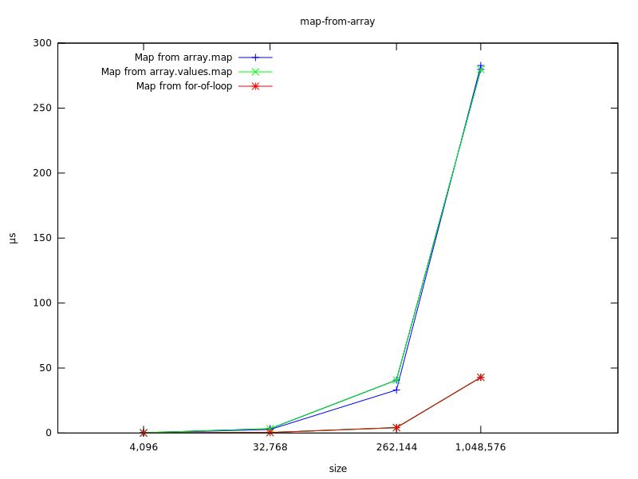
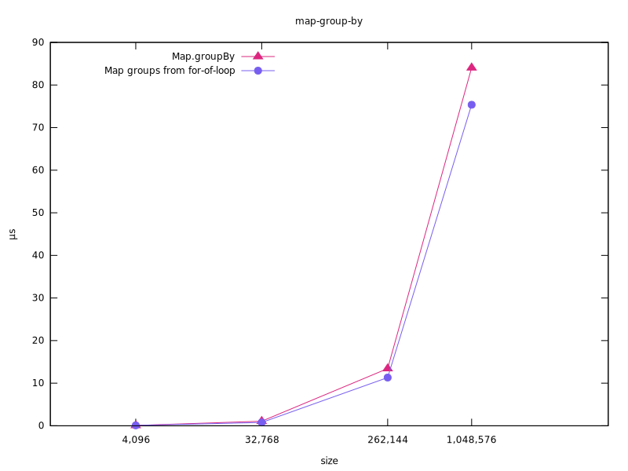
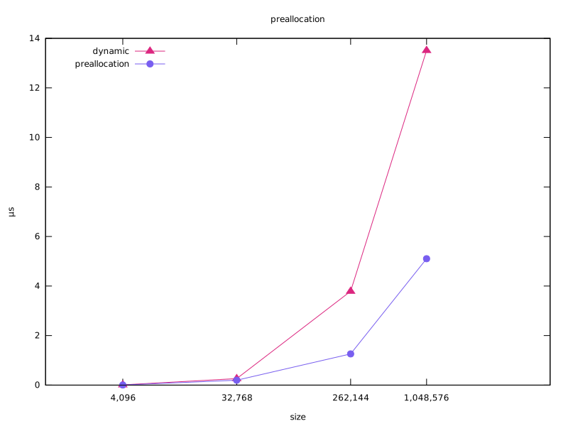
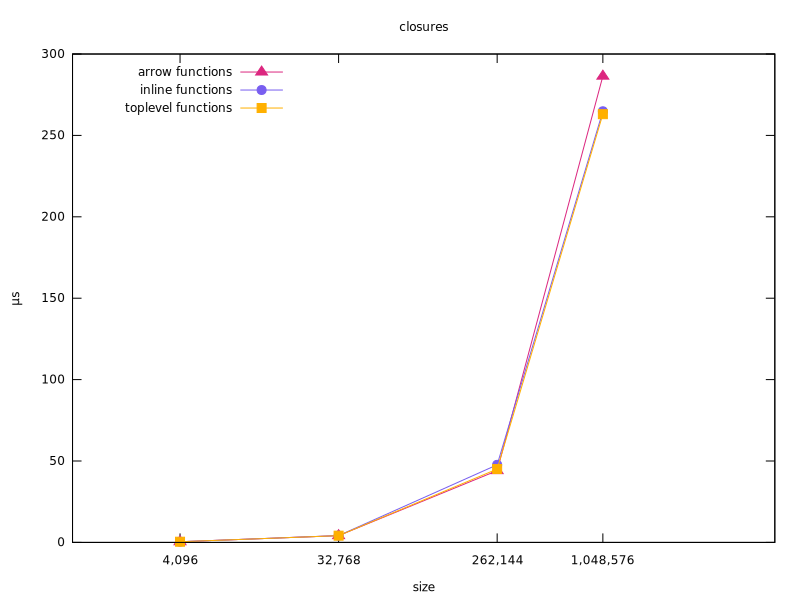
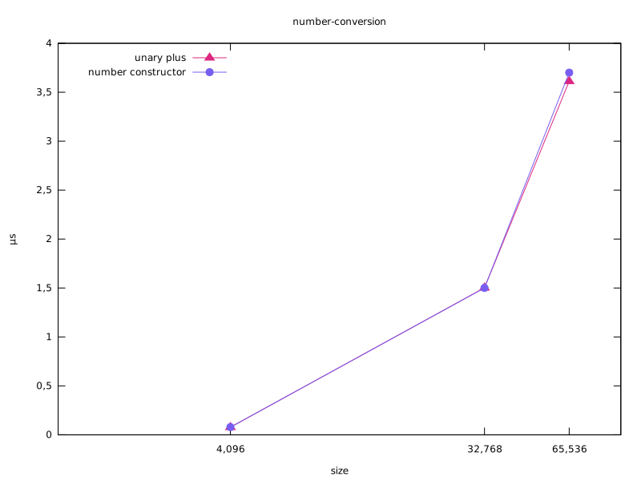

# About

Here are various Node benchmarks with a focus on backend development.

## Map from array

The fastest way to go from `array<T>` to `Map<K, T>` is with a loop:

```js
const map = new Map();
for (const x of input) {
  map.set(x.input, x);
}
return map;
```



Iterator helpers do not make a difference and actually cause more
allocations. I imagine this will close over time if key-value pair
allocations are ever optimized away.

## Map value groups from array

The fastest way to go from `array<T>` to `Map<K, array<T>>` is with a loop:

```js
const map = new Map();
for (const x of input) {
  const key = x.input % groups;
  const value = map.get(key);
  if (value) {
    value.push(x);
  } else {
    map.set(key, [x]);
  }
}
return map;
```

However, the benefit is not large:



It will be worth investigating performance again when
[getOrInsert](https://developer.mozilla.org/en-US/docs/Web/JavaScript/Reference/Global_Objects/Map/getOrInsert#browser_compatibility)
is supported in Node.

## Dynamic vs preallocation

Whenever possible preallocation should be used instead of `push` or `shift`:

```js
const arr = new Array(size);
```



## Closures

Since around 2018 there is no longer a penalty for using closures:



## Number conversion

`+x`, `Number(x)`, and `parseFloat(x)` are all about the same performance.  `+x` and `Number(x)` are the same operation, but `parseFloat` has different semantics.


