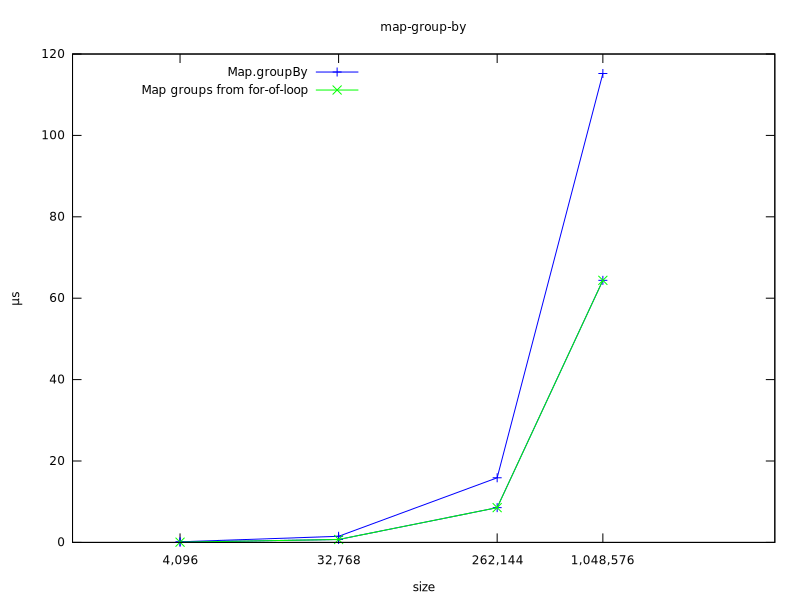

# About

Here are various Node benchmarks with a focus on backend development.

## Map from array

The fastest way to go from `array<T>` to `Map<K, T>` is with a loop:


Iterator helpers do not make a difference and actually cause more
allocations. I imagine this will close over time if key-value pair
allocations are ever optimized away.

## Map value groups from array

The fastest way to go from `array<T>` to `Map<K, array<T>>` is with a loop:

```js
const map = new Map();
for (const x of input) {
  const key = x.input % groups;
  const value = map.get(key);
  if (value) {
    value.push(x);
  } else {
    map.set(key, [x]);
  }
}
return map;
```

However, the benefit is not large:


